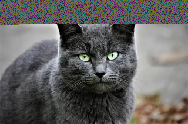
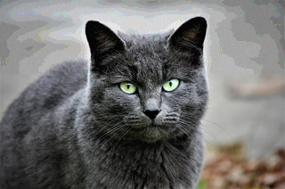
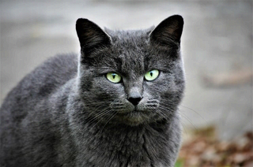
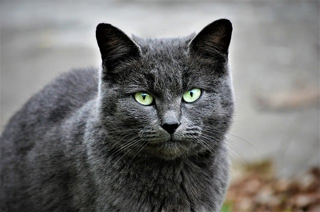

# Stenography : hiding a message inside an image


## Stenography VS Cryptography

Stenography is the art of hiding information inside another message, so that the existence of the information inside that message is not detected by humans intercepting the message.

It is different from cryptography, where the information is not hidden, but encrypted in such a way that only someone with the encryption key could decrypt it.


## Stenography inside an image

This script uses stenography to hide a message inside a PNG image by modifying the RGB values of each pixel to add a part of the secret message.

Each pixel in a PNG image is defined by 3 bytes : one for the red, one for the green and one for the blue bands.  
Some PNG images have a 4th byte for transparency, but this script only uses RGB images with no transparency band.    
These bytes are 8-bits numbers taking values from 0 to 255.

To hide a message inside an image, we lower the quality of the image by using some bits in each byte to store the secret message instead of the original image.  
The more bits we use to encode the secret message, the lower the quality of the image becomes.

If we use 2 bits in every byte of the image to store the secret message, then we would split the message into fragments of 2 bits, and insert one of these fragments in every byte of the image.  
The decoding process needs to go through each byte of the image in the same order and extract the 2 bits of the message, to reconstitute the secret message.

If the quality of the image is not reduced too much, the difference is not visible to the human eye, so no-one would suspect that a secret message is hidden inside the pixels of the image.


## Script Usage

### Encoding a message

To encode a secret message inside an image, use the following parameters :
- `--action encode` : the action must be `encode` (short form `-a`)
- `--image <path>` : the path of the input image to encode the message into (short form `-i`)
- `--message <path>` : the path of a text file containing the secret message to encode (short form `-m`)
- `-bits-per-byte <1, 2, 4 or 8>` : the number of bits used in each image byte to encode the message, default to 2 (short form `-b`)
- `--output <path>` : the path of the output image containing the encoded message (short form `-o`)

Example :
```commandline
python3 ./stenography_image.py -a encode -m test_data/grimm_fairy_tales.txt -i test_data/cat.png -b 4 -o test_data/cat_encoded_4.png
```

### Decoding a message

To decode a secret message from an image, use the following parameters :
- `--action decode` : the action must be `decode` (short form `-a`)
- `--image <path>` : the path of the input image to decode the message from (short form `-i`)
- `-bits-per-byte <1, 2, 4 or 8>` : the number of bits used in each image byte to encode the message, default to 2 (short form `-b`)
- `--output <path>` : the path of the output file to save the decoded message (short form `-o`)

Example :
```commandline
python3 ./stenography_image.py -a decode -i test_data/cat_encoded_4.png -b 4 -o test_data/decoded_message.txt
```

## Image quality 

The quality degradation of the encoded image depends on the number of bits of each image byte used to encode the secret message.

- `--bits-per-byte 8` : All 8 bits of the bytes of the original image are used to encode the secret message.    
  This means that the pixel values are completely changed and the image is destroyed.  
  This is obviously not a good value to hide a message inside an image.


- `--bits-per-byte 4` : Half of the 8 bits of the bytes of the original image are used to encode the image.  
  The maximum difference between the original and the new values of each byte is 15 (2^4 - 1).  
  The image is recognizable, but the quality degradation is visible.  
  This is not a great value to hide a message, as the low quality of the image may raise suspicion.


- `--bits-per-byte 2` : 2 of the 8 bits of the bytes of the original image are used to encode the image.  
  The maximum difference between the original and the new values of each byte is 3 (2^2 - 1).  
  The image looks identical to the original image.  
  This is the best value to hide a message, to be both undetected and space-efficient.


- `--bits-per-byte 1` : Only one of the 8 bits of the bytes of the original image is used to encode the image.  
  The maximum difference between the original and the new values of each byte is 1 (2^1 - 1).  
  The image also looks identical to the original image.    
  It is not a bad value to hide a message since it is undetected, but 2 is better since it takes twice less space inside the image.

|  |  |
|:----------------------------------------------------------------:|:----------------------------------------------------------------:|
|                       `--bits-per-byte 8`                        |                       `--bits-per-byte 4`                        |
|  |                         |
|                       `--bits-per-byte 2`                        |                          Original image                          |


## Technical details

- The chosen image format for this script is PNG, because it keeps the exact value of each pixel.  
  The JPG format cannot be used because it automatically performs compression, which alters the value of each pixel to minimize the storage.  
  This compression destructs the hidden fragments of the secret message.


- The secret message supports any UTF-8 text.  
  The message is first split into bytes, then each byte is split into multiple fragments, depending on the value of the `--bits-per-byte` parameter.  
  Each fragment is hidden into a byte of the image.  
  One pixel of the image contains 3 fragments, one inside each of its color band (R, G and B).


- When inserting fragments inside the image, we first insert a header made of a 4-bytes integer.  
  This integer stores the number of bytes of the encoded message, so we know when we decode the message how many fragments to retrieve.  
  This implies that the message length must be below 256^4 bytes (around 4Gb).


- An important limit to the message size is the dimension of the image.  
  We can store 3 fragments per pixel, so for a (600, 400) image for example, we can store 240,000 fragments.  
  If we use 2 bits per byte to encode the image, this means that each message byte is made of 4 fragments.  
  This implies a message limit of 240,000 / 4 = 60kb (including the 4 bytes header).


